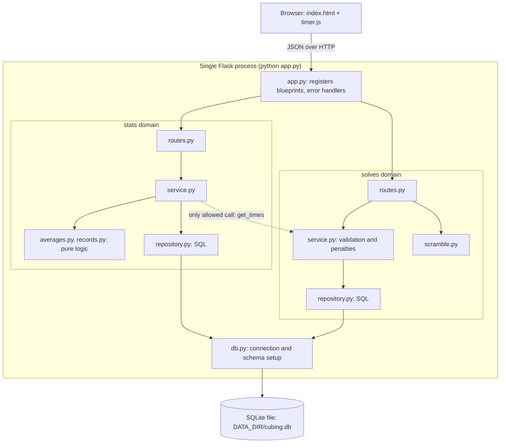

# Architecture

```mermaid
flowchart TD
    Browser["Browser: index.html + timer.js"] -->|"JSON over HTTP"| App

    subgraph Process["Single Flask process (python app.py)"]
        App["app.py: registers blueprints, error handlers"]
        subgraph Solves["solves domain"]
            SR["routes.py"] --> SS["service.py: validation and penalties"]
            SS --> SRP["repository.py: SQL"]
            SC["scramble.py"]
            SR --> SC
        end
        subgraph Stats["stats domain"]
            TR["routes.py"] --> TS["service.py"]
            TS --> AV["averages.py, records.py: pure logic"]
            TS --> TRP["repository.py: SQL"]
        end
        App --> SR
        App --> TR
        TS -.->|"only allowed call: get_times"| SS
        DB["db.py: connection and schema setup"]
        SRP --> DB
        TRP --> DB
    end

    DB --> File[("SQLite file: DATA_DIR/cubing.db")]
```
