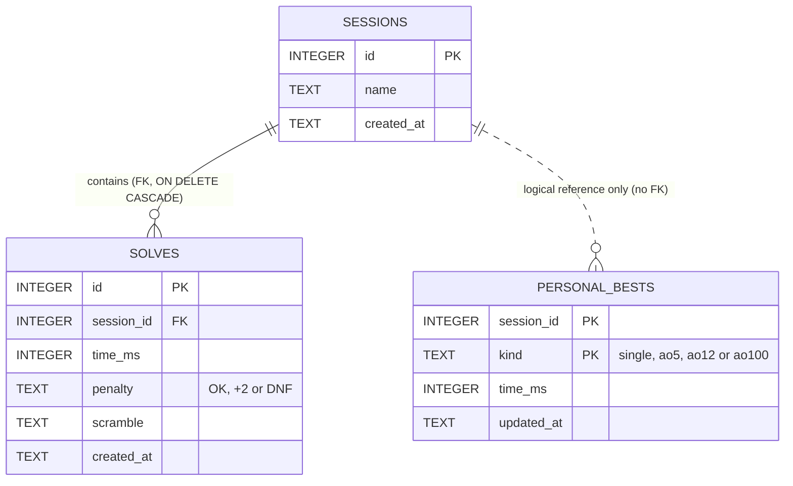

# Database schema

Domain ownership: `sessions` and `solves` belong to the solves domain, `personal_bests` to the stats domain. The dotted line is a convention kept in code, not a database constraint.
